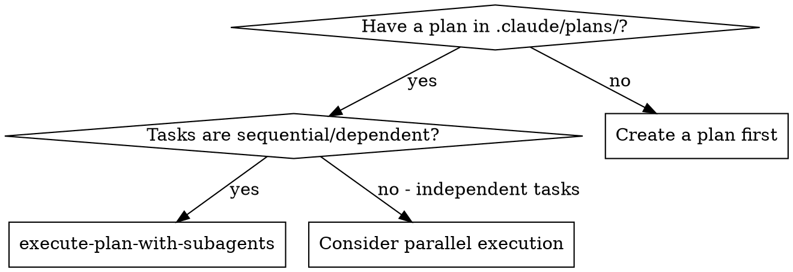
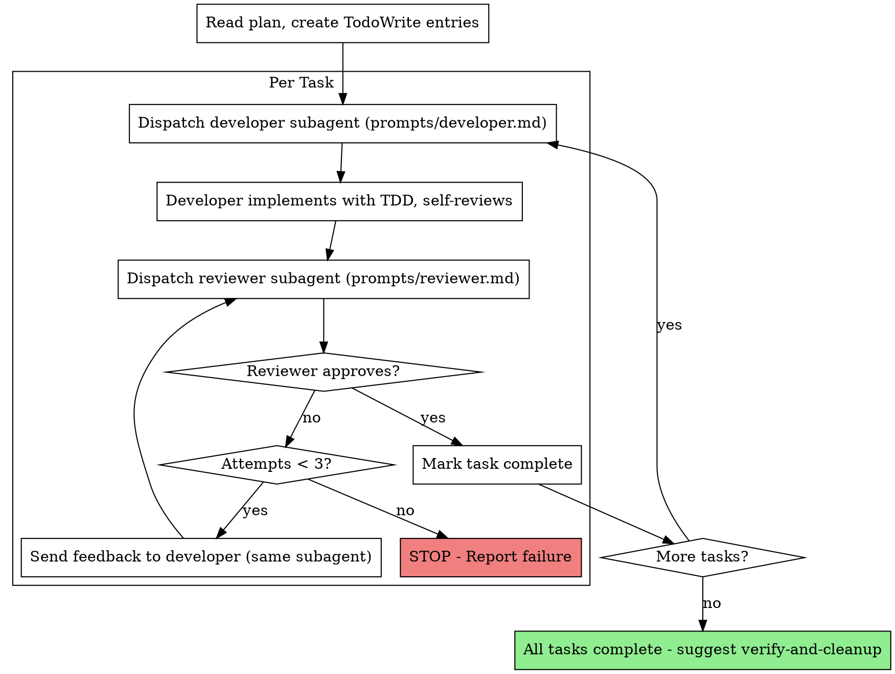

# Execute Plan With Subagents

Read a plan from `.claude/plans/` and execute it task-by-task using developer and reviewer subagents.

## When to Use



## Prerequisites

Before starting execution:

1. Invoke `workspace-setup` to ensure an isolated workspace.
2. Read the plan file from `.claude/plans/<plan-name>.md`.
3. Create TodoWrite entries for every task in the plan.

## Execution Loop



### Step 1: Dispatch Developer Subagent

Use the Task tool with the prompt from `prompts/developer.md`. Substitute placeholders with actual values from the current task.

The developer subagent MUST:
- Use the `test-driven-development` skill
- Self-review before signaling completion
- Commit changes with descriptive messages

### Step 2: Dispatch Reviewer Subagent

After the developer completes, use the Task tool with `prompts/reviewer.md`. Provide task details and files changed.

The reviewer subagent only reviews. It does not modify code.

### Step 3: Handle Review Result

**Pass:** Update TodoWrite to complete. Proceed to next task.

**Fail:** Extract feedback. Re-dispatch developer with original task PLUS feedback. Increment attempt counter.

**3 failures on single task:** STOP immediately. Output failure report:

```
## Execution Stopped

**Failed Task:** <task title>
**Attempts:** 3
**Last Reviewer Feedback:** <feedback>
**Files Modified:** <list of files touched across all attempts>
**Completed Tasks:** <list of tasks that passed before this failure>
```

## After All Tasks Complete

1. Mark all TodoWrite entries complete.
2. Tell the user: "All tasks complete. Use `verify-and-cleanup` to do a final check before merging."

## Example Workflow

```
Controller: I'm executing the plan from .claude/plans/auth-feature.md

[Read plan file, extract 3 tasks]
[Create TodoWrite with all tasks]

Task 1: Add login endpoint

[Mark Task 1 in_progress]
[Dispatch developer subagent with Task 1 details]

Developer: "Should the endpoint return a JWT or session cookie?"

Controller: "JWT - see existing auth patterns in src/auth/."

Developer: "Got it. Implementing now..."
[Later] Developer:
  - Wrote tests for login endpoint (3 tests)
  - Implemented POST /auth/login
  - All tests passing
  - Self-review: Added input validation I initially missed
  - Committed: "feat(auth): add login endpoint with JWT"

[Dispatch reviewer subagent]
Reviewer: PASS - Implementation matches spec, tests cover edge cases.

[Mark Task 1 complete]

Task 2: Add logout endpoint

[Mark Task 2 in_progress]
[Dispatch developer subagent with Task 2 details]

Developer: [No questions, proceeds]
Developer:
  - Wrote tests (2 tests)
  - Implemented POST /auth/logout
  - Tests passing
  - Committed

[Dispatch reviewer subagent]
Reviewer: FAIL - Missing token invalidation. Logout just returns 200 but doesn't actually invalidate the JWT.

[Attempt 2: Re-dispatch developer with feedback]
Developer:
  - Added token blacklist
  - Updated tests to verify invalidation
  - Committed: "fix(auth): add token invalidation on logout"

[Dispatch reviewer subagent]
Reviewer: PASS - Token invalidation working correctly.

[Mark Task 2 complete]

Task 3: Add refresh token endpoint
...

[After all tasks]
All tasks complete. Use `verify-and-cleanup` to do a final check before merging.
```

## Rules

**Never:**
- Start implementation on main/master without explicit user consent
- Skip the reviewer step
- Proceed with unfixed reviewer issues
- Dispatch multiple developer subagents in parallel (causes conflicts)
- Make subagents read the plan file (provide full task text instead)
- Skip self-review before dispatching reviewer
- Accept "close enough" on review feedback
- Move to next task while review has open issues
- Batch multiple tasks into one subagent dispatch
- Reorder or skip tasks

**If developer asks questions:**
- Answer clearly and completely
- Provide additional context if needed
- Do not rush them into implementation

**If reviewer finds issues:**
- Developer fixes them (same or new subagent)
- Reviewer reviews again
- Repeat until approved or 3 attempts exhausted

**If subagent fails completely:**
- Dispatch new subagent with specific fix instructions
- Do not attempt manual fixes (context pollution)

## Integration

**Required before starting:**
- `workspace-setup` - Set up isolated workspace

**Developer subagent uses:**
- `test-driven-development` - TDD workflow for each task

**After completion:**
- `verify-and-cleanup` - Final check before merging
