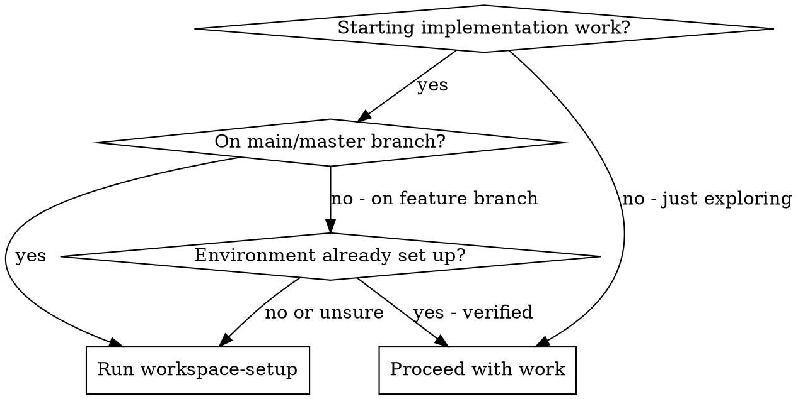

# Workspace Setup

Set up a fully isolated development environment: git worktree, correct language versions, and project-local dependencies.

## When to Use



## Workflow Overview

```dot
digraph workflow {
    rankdir=LR;
    node [shape=box];

    "Safety Check" -> "Create Worktree" -> "Switch Versions" -> "Package Isolation" -> "Install Deps" -> "Verify" -> "Ready";

    "Safety Check" [label="1. Safety Check\n(branch check)"];
    "Create Worktree" [label="2. Create Worktree\n(.worktrees/)"];
    "Switch Versions" [label="3. Switch Versions\n(pyenv/nvm/etc)"];
    "Package Isolation" [label="4. Package Isolation\n(venv/bundler/etc)"];
    "Install Deps" [label="5. Install Deps\n(pip/npm/etc)"];
    "Verify" [label="6. Verify\n(isolation check)"];
    "Ready" [label="Ready to Work" shape=ellipse style=filled fillcolor=lightgreen];
}
```



## Step 1: Safety Check

Check the current branch before any implementation work:

```bash
git rev-parse --abbrev-ref HEAD
```

**If on `main` or `master`:** STOP. Do not make code changes. Create a worktree first.

**If on a feature branch:** Confirm the path is under `.worktrees/`. If yes, continue to version/package checks.

## Step 2: Create Worktree

When starting fresh or the plan specifies a new branch:

1. Read the plan file to get the branch name from `## Branch Name` section.
2. Create the worktree:

```bash
mkdir -p .worktrees
git worktree add .worktrees/{{branch-name}} -b {{branch-name}}
cd .worktrees/{{branch-name}}
```

3. Verify location:

```bash
git rev-parse --abbrev-ref HEAD  # should print {{branch-name}}
pwd                               # should be under .worktrees/
```

**If worktree already exists:** Navigate to it instead of creating a new one.

## Step 3: Detect and Switch Versions

Check for version files and switch using the appropriate version manager.

**If version manager is not installed:** Warn the user and ask if they want to proceed with system default.

## Step 4: Set Up Package Isolation

Detect project type and configure isolation.

## Step 5: Install Dependencies

After isolation is configured, install dependencies

## Step 6: Verify Environment

Run the verification checklist before starting work:

```
Environment Verification:
- [ ] On feature branch (not main/master)
- [ ] Inside .worktrees/ directory
- [ ] Correct language version active (matches version file)
- [ ] Package isolation configured (venv active, bundler path set, etc.)
- [ ] Dependencies installed
- [ ] Test suite passes
```

## Rules

**Never:**
- Make implementation changes on `main` or `master`
- Run `pip install <package>` without an active venv
- Run `npm install -g <package>` (use `npx` instead)
- Run `gem install <package>` outside of Bundler
- Skip version manager check when version files exist
- Proceed if version manager reports wrong version
- Assume environment is set up without verification

**Always:**
- Create worktrees under `.worktrees/` at the repository root
- Activate venv before any Python commands
- Use `bundle exec` prefix for Ruby commands
- Verify isolation before starting work
- Re-run setup if switching to a different worktree
- Add `.worktrees/` to `.gitignore` if not already there

**If version manager is missing:**
- Warn the user clearly
- Ask if they want to proceed with system default
- Do not silently continue